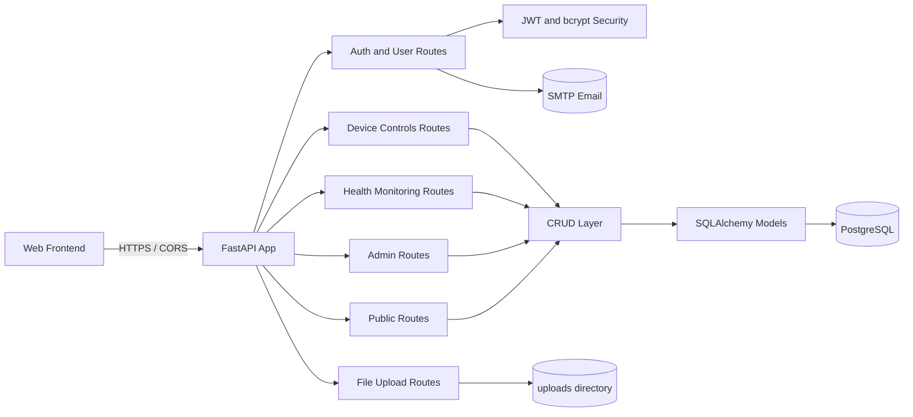

<div align="center">

# WOMB Backend


**A FastAPI backend for the WOMB (Wellness Optimal Mind Body) platform: it powers user accounts, JWT auth, wellness device controls, health monitoring records, and an admin content hub backed by PostgreSQL.**

<!-- TODO: screenshot/GIF - capture the auto-generated Swagger UI at /docs showing the grouped routers -->

</div>

> [!NOTE]
> This is an early-stage backend. Database tables are created automatically on startup with `Base.metadata.create_all`, and a few standalone scripts at the repo root handle one-off column migrations. There is no formal Alembic migration flow or test suite yet. Treat it as a working prototype.

## Table of Contents

- [About](#about)
- [Features](#features)
- [Tech Stack](#tech-stack)
- [Architecture](#architecture)
- [Getting Started](#getting-started)
- [Key Endpoints](#key-endpoints)
- [Project Structure](#project-structure)
- [Configuration](#configuration)
- [Roadmap](#roadmap)
- [Contributing](#contributing)
- [License](#license)

## About

WOMB Backend is the API service behind a wellness platform. The FastAPI app
declares itself as the "WOMB Backend" (Wellness Optimal Mind Body) and the
CORS settings reference the `wellnessoptimalmindbody.com` and `saunaura`
domains, so the API serves a connected web frontend.

The service handles three broad areas:

1. Accounts and access. Users sign up, log in, and receive JWT access and
   refresh tokens. Accounts carry a status (active, inactive, pending) and a
   role (User or Admin), so admins can approve, activate, or deactivate users.
2. Wellness hardware and health data. The API records device control states
   (sound, steam, temperature tank, water pump, nano flicker, LED color) and
   health monitoring entries (biofeedback, burn progress, brain monitoring,
   heart and brain synchronicity).
3. Content and admin hub. Admins manage news, live sessions, an "about" page,
   contact details, and category-based hub content. Public endpoints expose
   the latest news, the current live session, and landing-page content without
   authentication.

> Naming note: the repository is named `backvincy`, but the application, its
> title, and its domains are all "WOMB" / "Wellness Optimal Mind Body". A
> rename to something like `womb-backend` would make the repo match the code
> and improve discovery.

## Features

- JWT authentication with separate access and refresh tokens, plus a dedicated
  admin login that returns an `is_admin` flag.
- Role-based access (User and Admin) and account status gating (active,
  inactive, pending) enforced at login.
- Extended user profiles with health and lifestyle fields (gender, sleep
  hours, exercise frequency, smoking, alcohol, and more).
- Device control records for six wellness devices: sound, steam, temp tank,
  water pump, nano flicker, and LED color.
- Health monitoring records: biofeedback, burn progress, brain monitoring, and
  heart and brain synchronicity.
- Admin content management for news, live sessions, about page, contact
  information, and a category-based hub.
- Public landing-page endpoints for latest news, latest live session, contact,
  about, and hub categories.
- Image upload endpoint with static file serving from the `/uploads` path.
- Email notification to the admin on new user signup (SMTP).

## Tech Stack

| Layer | Technology |
|-------|------------|
| Language | Python 3.10+ |
| Web framework | FastAPI 0.115 |
| ASGI server | Uvicorn 0.34 |
| ORM | SQLAlchemy 2.0 |
| Database | PostgreSQL (via psycopg2-binary) |
| Validation | Pydantic 2.11 + pydantic-settings |
| Auth | python-jose (JWT), passlib + bcrypt |
| Email | smtplib (standard library) |
| Tooling | black, isort, flake8, mypy, pre-commit |

## Architecture



The app follows a layered structure. Routers in `app/api` receive requests,
validate them with Pydantic schemas in `app/schemas`, call functions in the
`app/crud` layer, which operate on SQLAlchemy models in `app/models` against a
PostgreSQL database. Shared concerns like config, security, and the database
session live in `app/core` and `app/db`.

## Getting Started

### Prerequisites

```bash
# Python 3.10 or newer and a running PostgreSQL instance
python3 --version
psql --version
```

### Installation

```bash
git clone https://github.com/atiqbitstream/backvincy.git
cd backvincy

python3 -m venv venv
source venv/bin/activate        # On Windows: venv\Scripts\activate

pip install -r requirements.txt
```

Create a `.env` file in the project root with the variables listed in
[Configuration](#configuration).

### Run

```bash
uvicorn app.main:app --reload
```

The API starts on `http://127.0.0.1:8000`. Tables are created automatically on
startup. Open the interactive docs at `http://127.0.0.1:8000/docs`.

## Key Endpoints

Routes are grouped by router prefix. This is a selection, not the full list.
Visit `/docs` for the complete, interactive reference.

| Method | Path | Purpose |
|--------|------|---------|
| POST | `/auth/signup` | Register a new user |
| POST | `/auth/login` | Log in and receive JWT tokens |
| POST | `/auth/admin-login` | Admin login with `is_admin` flag |
| POST | `/auth/refresh` | Exchange a refresh token for a new access token |
| POST | `/auth/logout` | Log out the current user |
| GET | `/users/me` | Get the current user profile |
| GET | `/users` | List users (admin only) |
| GET | `/device-controls/sound/{id}` | Read a device control record |
| POST | `/health-monitoring/biofeedback` | Create a biofeedback record |
| GET | `/latest-news` | Public: latest news for the landing page |
| GET | `/about` | Public: about page content |
| POST | `/image` | Upload an image |
| GET | `/debug/routes` | List all registered routes |

## Project Structure

```text
backvincy/
  app/
    api/         Route handlers grouped by feature (auth, users, device controls, health, admin, public)
    core/        Settings (config) and security (JWT, password hashing)
    crud/        Database read and write functions per model
    db/          SQLAlchemy engine, session, and Base
    models/      SQLAlchemy ORM models (users, devices, health, hub, news, etc.)
    schemas/     Pydantic request and response schemas
    services/    Auth service flow and email notifications
    main.py      App setup, CORS, router wiring, static mounts
  uploads/       Uploaded image files served under /uploads
  requirements.txt
  *.py           Standalone one-off column migration scripts
```

## Configuration

The app reads settings from a `.env` file via `pydantic-settings`. Variables
without a default are required.

| Variable | Description | Default |
|----------|-------------|---------|
| `DATABASE_URL` | PostgreSQL connection string | required |
| `SECRET_KEY` | Secret used to sign JWT tokens | required |
| `ALGORITHM` | JWT signing algorithm | `HS256` |
| `ACCESS_TOKEN_EXPIRE_MINUTES` | Access token lifetime in minutes | `1440` |
| `REFRESH_TOKEN_EXPIRE_MINUTES` | Refresh token lifetime in minutes | `10080` |
| `SMTP_SERVER` | SMTP host for email | `smtp.gmail.com` |
| `SMTP_PORT` | SMTP port | `587` |
| `EMAIL_SENDER` | From address for notifications | required |
| `EMAIL_PASSWORD` | SMTP password or app password | required |
| `ADMIN_EMAIL` | Address that receives signup notifications | required |

## Roadmap

- [ ] Replace the standalone migration scripts with a managed Alembic flow.
- [ ] Add automated tests and continuous integration.
- [ ] Move uploaded files to durable object storage.
- [ ] Add API rate limiting and refresh token revocation on logout.
- [ ] Provide a `.env.example` and Docker setup for local development.

## Contributing

Contributions are welcome. Open an issue to discuss a change, then submit a
pull request against the default branch.

## License

Distributed under the MIT License. See [LICENSE](LICENSE).
